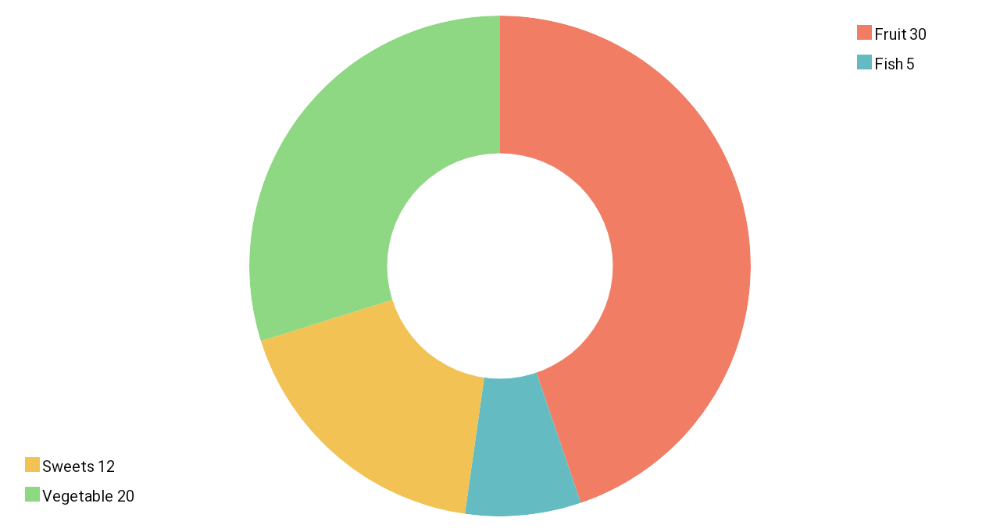

# SimpleXarts

SimpleXarts is a live update Xamarin.Forms charting library, designed to be used with MVVM.

## Getting started

### Install

Not yet on NuGet, because the structure of the charts is still subject to change,
to support a wider range of platforms.

Its not recommended to be used in its current state.

### Display a chart

#### 1) Create the data to bind to a chart.
```csharp
public ObservableCollection<Figure> Data { get; set; } = new ObservableCollection<Figure>()
{
    new Figure(20)
    {
        Describtion = "Fruit",
        Color = Xamarin.Forms.Color.FromRgb(240, 125, 100)
    },
    new Figure(5)
    {
        Describtion = "Fish",
        Color = Xamarin.Forms.Color.FromRgb(100, 188, 194)
    },
    new Figure(12)
    {
        Describtion = "Sweets",
        Color = Xamarin.Forms.Color.FromRgb(242, 194, 84)
    },
    new Figure(20)
    {
        Describtion = "Vegetable",
        Color = Xamarin.Forms.Color.FromRgb(142, 215, 131)
    }
};
```
##### References:
* [Figure](Source/ChartBase/Figure.cs)
* [ObservableCollection<T>](https://docs.microsoft.com/de-de/dotnet/api/system.collections.objectmodel.observablecollection-1?view=netframework-4.8)
* [Xamarin.Forms.Color](https://docs.microsoft.com/de-de/dotnet/api/xamarin.forms.color?view=xamarin-forms)
#### 2) Bind the data to a chart.
```xaml
<SimpleXarts:DonutChart Figures="{Binding Data} />
```
##### References:
* [DonutChart](Source/SpecificCharts/DonutChart.cs)



#### 3) Update your data
```csharp
//change the value of an existing Figure
Data[0].Value = 30;

//add a new Figure to the chart
Data.Add(
    new Figure(20)
    {
        Describtion = "Spices",
        Color = Color.FromRgb(66, 72, 86)
    }
);

//remove a figure from the chart
Data.RemoveAt(1);
```